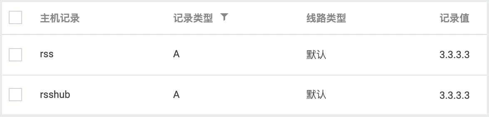

# rssforever
## 简介
本项目为 Nginx + TTRSS + RSSHub + Watchtower + ACME 整合 docker 容器化快速一键部署方案,支持一键脚本快速安装部署.

### 前言
[rssforever.com](rssforever.com) 为网友提供免费的 RSS 和 RSSHub 服务已经一年有余,由于服务器压力及个人精力有限等原因已停止提供 RSS 服务.鉴于很多新手用户技术有限,特将 nginx , ttrss , rsshub 三个项目整合到 docker compose 中,实现一键部署使用.

### 特点
1. 本项目针对新手用户,提供整合配置,无需繁琐的设置,即使是新手用户最快也只需要几步操作,几分钟即可部署使用.
2. 使用 docker compose 编排配置,所有命令,配置及环境变量集中管理,方便维护和迁移.
3. 更换服务器也仅需打包备份一个文件夹,迁移解压后一条命令即可恢复使用.

### 环境需求
- 至少 1 核 1G 境外 VPS 服务器 ( 国内服务器由于网络问题,不推荐使用. )
- 拥有自己的域名 ( 自行申请泛域名证书可使用 HTTPS 部署 )
- 服务器未占用 80/443 端口
- 服务器已安装 docker 和 docker compose 环境 ( 未安装可参考下文简易安装指南 )

> 本项目不支持已被其他服务占用 80/443 端口的服务器.请停止相关服务或更换新服务器部署使用.  
> 此项目最多一共会启动 10 个容器,服务器性能不足请不要部署其他应用,并且私有化个人使用.避免服务器压力过大.  
> 如果服务器上已有 nginx 等占用 80/443 端口的服务,同时又有部署的需求,请联系我进行付费技术支持.


---

## 更新
**2021-06-18** 更新一键安装脚本.

## 一键安装脚本
一键安装脚本支持以下四种模式,请根据自身情况选择.
1. nginx + ttrss + rsshub + watchtoer + acme 自动申请和续签证书并开启 HTTPS 模式
2. nginx + ttrss + rsshub + watchtoer + 无证书 HTTP 模式
3. nginx + ttrss + acme 自动申请和续签证书并开启 HTTPS 模式
4. nginx + ttrss + 无证书 HTTP 模式

### 前期准备
本脚本适用于`ttrss`和`rsshub`域名使用同一根域名,例如`rss.rssforever.com`和`rsshub.rssforever.com`将自动申请`*.rssforever.com`泛域名证书.且脚本仅适用于首次安装.请提前将以上域名解析指向服务器.同时参考 [这篇文章](https://www.ioiox.com/archives/87.html) 中的 `准备 DNS API` 章节来获取域名服务商 API 以便脚本申请证书使用.

### 执行脚本
```shell
wget https://raw.githubusercontent.com/stilleshan/rssforever/main/install.sh && chmod +x install.sh && ./install.sh
```

### 定时更新证书
证书每月`1`日自动更新,请执行以下命令来定时每月重启`nginx`服务刷新证书.也可每月手动执行`docker-compose restart`来重启服务.
```shell
crontab -e
# 添加以下计划任务
0 0 2 * * docker restart rssforever_nginx_1
# 为避免时区问题,将在每月 2 号 0 点执行
```

## 手动部署
**首次部署建议使用上文一键安装脚本,以便配置证书的申请和更新.下文手动部署将无法自动更新证书.**

docker 及 docker compose 必须提前安装到服务器中,相关教程网上很多,也可逐一执行以下 6 条命令安装启动:
```shell
# 安装 docker
curl -fsSL https://get.docker.com -o get-docker.sh
sudo sh get-docker.sh
sudo systemctl start docker
sudo systemctl enable docker
# 安装 docker compose
curl -L https://github.com/docker/compose/releases/download/1.29.0/docker-compose-`uname -s`-`uname -m` -o /usr/local/bin/docker-compose
chmod +x /usr/local/bin/docker-compose
```
安装完成并检查
```shell
docker -v
docker-compose -v
```

### 配置域名解析
分别为`RSS`和`RSSHub`两个站点配置两个二级域名,例如`rss.yourdomain.com`和`rsshub.yourdomain.com`.并设置 A 记录或 CNAME 到服务器.



### HTTP 部署
#### 拉取代码
```shell
git clone https://github.com/stilleshan/rssforever.git
# 拉取代码
cd rssforever
# 进入目录,注意不要修改目录名,否则会导致 watchtower 无法监控容器自动更新镜像.
```

#### 配置 .env 文件
修改`.env`文件中`RSS`和`RSSHub`的域名以及数据库密码
```shell
RSS_DOMAIN=rss.yourdomain.com
RSSHUB_DOMAIN=rsshub.yourdomain.com
POSTGRES_PASSWORD=rssforever.com
```

#### 启动
```shell
docker-compose up -d
# 再次注意需要在 rssforever 目录下执行
```

#### 完成
访问 http://rss.yourdomain.com 使用`admin`和`password`登陆使用,请及时修改密码.  
访问 http://rsshub.yourdomain.com 并参考[官方文档](https://docs.rsshub.app/)使用.

### HTTPS 部署
#### 拉取代码
```shell
git clone https://github.com/stilleshan/rssforever.git
# 拉取代码
cd rssforever
# 进入目录,注意不要修改目录名,否则会导致 watchtower 无法监控自动更新容器.
```

#### 配置 .env 文件
修改`.env`文件中`RSS`和`RSSHub`的域名以及数据库密码
```shell
RSS_DOMAIN=rss.yourdomain.com
RSSHUB_DOMAIN=rsshub.yourdomain.com
POSTGRES_PASSWORD=rssforever.com
```

上传`泛域名`证书和密钥文件至`nginx/ssl`目录下.  
并以`yourdomain.com.cer`形式命名,证书后缀`cer`或者`crt`等均不影响使用.  
修改`.env`文件中域名证书和密钥文件名  
修改`.env`文件中`PROTOCOL=https`  
具体参考如下:
```shell
PROTOCOL=https
RSS_DOAMIN_CERT=yourdomain.com.cer
RSS_DOMAIN_KEY=yourdomain.com.key
RSSHUB_DOAMIN_CERT=yourdomain.com.cer
RSSHUB_DOMAIN_KEY=yourdomain.com.key
```
**注意:如果使用单域名证书,请分别将两个域名证书上传至`nginx/ssl`中,分别修改`.env`文件中 RSS 和 RSSHub 域名证书和密钥文件名.**
```shell
# 单域名参考配置
RSS_DOAMIN_CERT=rss.yourdomain.com.cer
RSS_DOMAIN_KEY=rss.yourdomain.com.key
RSSHUB_DOAMIN_CERT=rsshub.yourdomain.com.cer
RSSHUB_DOMAIN_KEY=rsshub.yourdomain.com.key
```

#### 启动
```shell
docker-compose up -d
# 再次注意需要在 rssforever 目录下执行
```

#### 完成
访问 https://rss.yourdomain.com 使用`admin`和`password`登陆使用,请及时修改密码.  
访问 https://rsshub.yourdomain.com 并参考[官方文档](https://docs.rsshub.app/)使用.


---


## 进阶
### 强制跳转 HTTPS
**2021-05-28 新增功能:**  
当`.env`配置`PROTOCOL=https`时,将自动配置`return 301`强制跳转至`HTTPS`协议.

### 证书更新
本项目目前并未配置自动更新证书的功能,今后视情况加入其中.  
泛域名有效期三个月,请自行续签后覆盖原有证书,执行`docker-compose down`停止服务,并在次执行`docker-compose up -d`启动即可.

### 高级配置
TTRSS 和 RSSHub 可以通过修改`docker-compose.yml`设置环境变量来配置高级功能,详情请参考本文末尾项目官方文档进行修改.  
值得注意的是本项目的`docker-compose.yml`定制化过多,请慎重修改.  
通常来说修改`volumes`和`environment`参数来挂载目录,设置一些高级配置并不会对本服务有影响.如诺出现问题请提交`issue`.

### 备份恢复
#### 备份
本项目采用 docker compose 部署,所有配置及数据都在`rssforever`目录中,方便备份和迁移.  
`rss`目录会在项目启动后自动生成,存放`rss`的数据库,不可删除.( 除非希望重新部署 )  
`rsshub`目录会在项目启动后自动生成,此目录为缓存数据,迁移时可以删除以免占用过大空间.  
**其他所有文件及目录,如不清楚请不要随意修改和删除,否则会导致服务无法启动.**
#### 恢复
将域名 A 记录重新指向新服务器,将备份的`rssforever`目录解压进入启动即可.
```shell
cd rssforever
# 进入目录
docker-compose up -d
# 启动
```

### 初始化
如果误操作修改了相关参数导致无法使用,请备份`rss`目录后,删除整个`rssforever`目录.重新按照上文`git clone`拉取代码,修改`.env`文件,在将`rss`移动至`rssforever`下,执行`docker-compose up -d`重新部署.


---


## 其他
### 感谢
感谢以下大神提供的项目:
- [Awesome TTRSS 官方文档](https://ttrss.henry.wang/)
- [Awesome TTRSS GitHub](https://github.com/HenryQW/Awesome-TTRSS)
- [RSSHub 官方文档](https://docs.rsshub.app/)
- [DIYgod/RSSHub GitHub](https://github.com/DIYgod/RSSHub)

### 链接
- [rssforever.com](https://rssforever.com)  
- [RSSHub 公共服务](https://rsshub.rssforever.com)  
- [泛域名证书申请相关文章](https://www.ioiox.com/tag/SSL/)
- [新手教程 Nginx + TTRSS + RSSHub 整合 docker 容器化快速一键部署方案](https://www.ioiox.com/archives/133.html)
